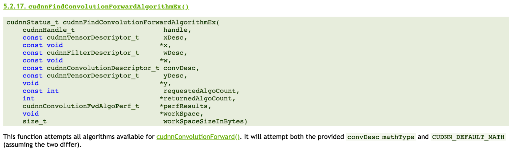

### ECE 5545 Machine Learning Hardware and Systems

# Assignment 4: Implementations and Approximations of DNN Primitives

`"Technology is a useful servant but a dangerous master." -- Christian Lous Lange, Historian`

Assigned on: Wednesday April 9th    
**Due: Monday May 5th**

Total marks = 16/100    
(-2 marks per day late)



----

## Overview

There are different ways of implementing convolutions and linear layers by factorizing the mathematical operations differently (multiplications and additions), or by using transformations to different numerical domains (such as the log or frequency domain). In this assignment we will perform different implementations of linear and convolution primitives. Next we will explore the accuracy implications, especially at low precision when using some of these transformations. Finally, we will investigate the potential speedup of each approach. Modern deep learning libraries like CuDNN typically have different kernel implementations such as the ones in this assignment, and there are library calls to try them all out and select the best one experimentally (see image above).

## Implementation & Write-up

1. Implement `im2col`, `winograd` and `fft` in `src.conv2d`.
2. Implement `svd` and `logmatmul` in `src.matmul`.

For both. (1) and (2) above, there are functionality tests provided in this assignment to check that your implementations are correct. In general, you are required to use python code to implement each of those functions with 2 exceptions. (1) For singular value decomposition (SVD) where you are allowed to use `numpy` or other libraries to perform the decomposition itself. (2) For `fft`, you may use an FFT2D or similar functions from `pytorch` or other libraries. However, keep in mind that there is more to implementing a convolution in the FFT domain than just conversion. For the `FFT` problem in particular, please describe your implementation in your writeup.

3. Perform an investigation of numerical precision in the provided notebook `1-numerical_precision.ipynb`. We would like to investigate whether there is a _reconstruction error_ introduced by using these alternative kernel implementations. For each transform, plot the reconstruction error vs. numerical precision and compare it to the naive implementation. Comment on any loss of accuracy.
4. SVD is a special transformation because it actually results in more computations. However, after SVD decomposition, we can remove singular values for low-rank matrices to approximate the matrix without losing too much accuracy. Notebook `2-svd_rank.ipynb` has placeholders for investigating the accuracy and speedup of the SVD-transformed matrices for different kinds of input. Complete the notebook, plot accuracy vs. rank for different inputs and speedup vs. rank. Comment on your results.

For parts (3) and (4), include the plots in your writeup along with your commentary on the results.

5. You will now apply SVD to a small neural network performing digit recognition. Instead of measuring the reconstruction error, we will instead measure the impact on accuracy (which is ultimately what we care about). Plot the compression ratio vs. accuracy and the compression ratio vs. measured runtime. Combine the two plots in another plot that has runtime on the x-axis and accuracy on the y-axis. We have provided the file `mnist.py` for you to perform your accuracy and speed investigation. In your writeup, paste your final plots and comment on the observed trends. Note that you will actually have to change the model to perfrom a modified matrix multiplication. For SVD, we have 3 matrices instead of 1--think about how you want to implement this to get the best speedup and explain your custom layer implementation in the writeup.

6. [optional] **Extra Credit (1 bonus mark):**  In part (2), you implemented `logmatmul` most likely by multiplying in the log domain then converting back out of the log domain before the addition. For extra credit, implement NVidia's patentented version of doing approximate addition in the log domain found [here](https://uspto.report/patent/app/20210056446). Explain your implementation and test its reconstruction error at different numerical precisions.

----

# SVD Compression for Neural Networks

This project demonstrates the application of Singular Value Decomposition (SVD) to compress a neural network for MNIST digit recognition. Instead of just measuring reconstruction error, we focus on the impact of compression on accuracy and runtime.

## Files

- `mnist.py`: Original MNIST neural network (from PyTorch examples)
- `train_original.py`: Script to train the original model and save it
- `svd_mnist.py`: Implementation of neural network with SVD compression and training pipeline
- `svd_analysis.py`: Analysis script to test different compression ratios on a pre-trained model

## How it Works

### SVD Compression

Singular Value Decomposition is a technique that decomposes a matrix **W** into three matrices:

```
W = U * Σ * V^T
```

Where:
- **U** is an m×m orthogonal matrix
- **Σ** is an m×n diagonal matrix with non-negative real numbers (singular values)
- **V^T** is an n×n orthogonal matrix (transpose of V)

For compression, we keep only the top-k singular values and their corresponding vectors:

```
W ≈ U_k * Σ_k * V_k^T
```

In a neural network, we replace the standard matrix multiplication `y = Wx + b` with the SVD-compressed version:

```
y = (U_k * Σ_k * V_k^T)x + b
```

For computational efficiency, we compute this as:

```
y = x @ V_k @ diag(Σ_k) @ U_k^T + b
```

### Compression Ratio

The compression ratio is calculated as the ratio of parameters in the compressed representation vs. the original:

- Original parameters: in_features × out_features + out_features (weights + bias)
- Compressed parameters: k × (in_features + out_features + 1) (k is the reduced rank)

## Usage

### 1. Train the Original Model

```bash
python train_original.py --epochs 14 --save-model mnist_fc.pt
```

This trains the original model for 14 epochs and saves it to `mnist_fc.pt`.

### 2. Apply SVD Compression and Train from Scratch

```bash
python svd_mnist.py --epochs 5
```

This trains models with various compression ratios (from 1.0 to 0.05) and generates plots comparing accuracy and runtime.

### 3. Apply SVD Compression to Pre-trained Model

```bash
python svd_analysis.py --model-path mnist_fc.pt
```

This takes a pre-trained model, applies SVD compression with different ratios, and evaluates accuracy and runtime.

## Results

The code generates three plots:

1. Compression Ratio vs. Accuracy - shows how accuracy changes with increasing compression
2. Compression Ratio vs. Runtime - shows how runtime changes with increasing compression
3. Runtime vs. Accuracy - shows the tradeoff between runtime and accuracy

In `svd_analysis.py`, an additional plot of Compression Ratio vs. Reconstruction Error is generated to show how well the compressed matrices approximate the original weights.

## Notes on SVD Layer Implementation

The SVD layer implementation has two options for the forward pass:

1. Reconstruct the weight matrix and use standard linear operation (slower):
   ```python
   weight = self.U @ torch.diag(self.S) @ self.V.t()
   return F.linear(x, weight, self.bias)
   ```

2. Compute matrix multiplications directly (faster):
   ```python
   output = x @ self.V @ torch.diag(self.S) @ self.U.t() + self.bias
   ```

The second approach is used in the implementation as it provides better runtime performance by avoiding the explicit reconstruction of the weight matrix.
