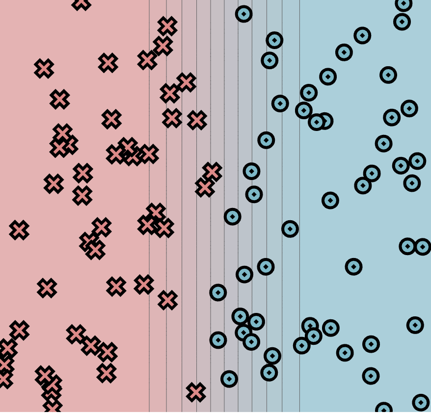

# MiniTorch Module 0

Simple

Parameters:
linear.weight_0_0 = -6.79, linear.weight_1_0 = 0, linear.bias_0 = 3.32

Diag

Parameters:
linear.weight_0_0 = -7.9, linear.weight_1_0 = -7.05, linear.bias_0 = 3.32

* Docs: https://minitorch.github.io/

* Overview: https://minitorch.github.io/module0/module0/