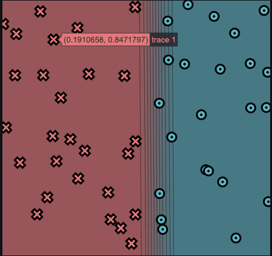
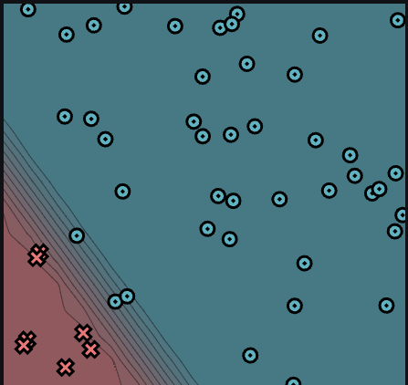
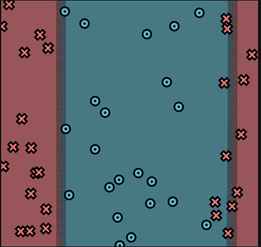
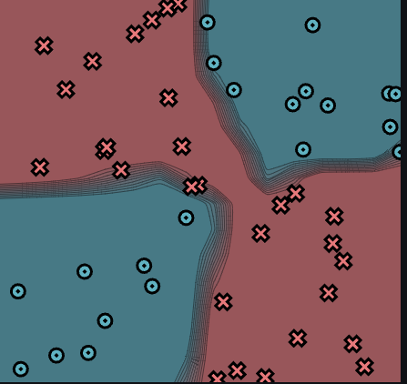

[](https://classroom.github.com/a/7COonC5j)
# MiniTorch Module 1


* Docs: https://minitorch.github.io/

* Overview: https://minitorch.github.io/module1/module1/

This assignment requires the following files from the previous assignments. You can get these by running

```bash
python sync_previous_module.py previous-module-dir current-module-dir
```

The files that will be synced are:

        minitorch/operators.py minitorch/module.py tests/test_module.py tests/test_operators.py project/run_manual.py


# Task 1.5


### Simple

Log:

Epoch: 0/500, loss: 0, correct: 0
Epoch: 0/500, loss: 0, correct: 0
Epoch: 10/500, loss: 34.28558170837072, correct: 26
Epoch: 20/500, loss: 34.230230148735195, correct: 26
Epoch: 30/500, loss: 34.17492290592378, correct: 26
Epoch: 40/500, loss: 34.11817958127709, correct: 27
Epoch: 50/500, loss: 34.05883869698103, correct: 28
Epoch: 60/500, loss: 33.99590563924762, correct: 28
Epoch: 70/500, loss: 33.92845690240863, correct: 28
Epoch: 80/500, loss: 33.85290518978237, correct: 29
Epoch: 90/500, loss: 33.74591173617895, correct: 30
Epoch: 100/500, loss: 33.616862681312625, correct: 30
Epoch: 110/500, loss: 33.44723440937819, correct: 31
Epoch: 120/500, loss: 33.257155724205845, correct: 32
Epoch: 130/500, loss: 32.97481054391058, correct: 34
Epoch: 140/500, loss: 32.61956853881103, correct: 34
Epoch: 150/500, loss: 32.2542024694998, correct: 34
Epoch: 160/500, loss: 31.856153512381166, correct: 34
Epoch: 170/500, loss: 31.44923686024654, correct: 33
Epoch: 180/500, loss: 31.017847535786405, correct: 34
Epoch: 190/500, loss: 30.44067909163451, correct: 35
Epoch: 200/500, loss: 29.77555836344347, correct: 34
Epoch: 210/500, loss: 29.14240219334485, correct: 35
Epoch: 220/500, loss: 28.361081724689207, correct: 37
Epoch: 230/500, loss: 27.581554214175064, correct: 40
Epoch: 240/500, loss: 26.695006677667575, correct: 40
Epoch: 250/500, loss: 25.749088410109714, correct: 40
Epoch: 260/500, loss: 24.78801881861092, correct: 42
Epoch: 270/500, loss: 23.78753905859879, correct: 42
Epoch: 280/500, loss: 22.75966642238027, correct: 44
Epoch: 290/500, loss: 21.735552561665767, correct: 44
Epoch: 300/500, loss: 20.701517797485298, correct: 44
Epoch: 310/500, loss: 19.683730629438823, correct: 45
Epoch: 320/500, loss: 18.67639239284819, correct: 45
Epoch: 330/500, loss: 17.685219380677875, correct: 45
Epoch: 340/500, loss: 16.748545905020766, correct: 45
Epoch: 350/500, loss: 15.863171093306782, correct: 45
Epoch: 360/500, loss: 15.023507456389737, correct: 45
Epoch: 370/500, loss: 14.232641604175763, correct: 45
Epoch: 380/500, loss: 13.493095270778614, correct: 45
Epoch: 390/500, loss: 12.802461839569961, correct: 46
Epoch: 400/500, loss: 12.15876827304579, correct: 46
Epoch: 410/500, loss: 11.570807451600649, correct: 47
Epoch: 420/500, loss: 11.04356736648889, correct: 47
Epoch: 430/500, loss: 10.55637464737881, correct: 47
Epoch: 440/500, loss: 10.113128401481976, correct: 47
Epoch: 450/500, loss: 9.70043446646289, correct: 49
Epoch: 460/500, loss: 9.314835354114162, correct: 49
Epoch: 470/500, loss: 8.959237143290707, correct: 49
Epoch: 480/500, loss: 8.627616585081958, correct: 49
Epoch: 490/500, loss: 8.315560473546169, correct: 49
Epoch: 500/500, loss: 8.0246823319849, correct: 49
Epoch: 10/500, loss: 34.54511450549197, correct: 25
Epoch: 20/500, loss: 34.43993848126948, correct: 25
Epoch: 30/500, loss: 34.31637075722849, correct: 27
Epoch: 40/500, loss: 34.194542538285425, correct: 27
Epoch: 50/500, loss: 34.0483229770289, correct: 29
Epoch: 60/500, loss: 33.8863580162248, correct: 27
Epoch: 70/500, loss: 33.678798835786594, correct: 27
Epoch: 80/500, loss: 33.34123763399836, correct: 27
Epoch: 90/500, loss: 33.02909544608064, correct: 27
Epoch: 100/500, loss: 32.711815170551795, correct: 27
Epoch: 110/500, loss: 32.35984088749702, correct: 33
Epoch: 120/500, loss: 31.973520747492486, correct: 33
Epoch: 130/500, loss: 31.597520532048495, correct: 33
Epoch: 140/500, loss: 31.19850120927017, correct: 33
Epoch: 150/500, loss: 30.766666742337893, correct: 34
Epoch: 160/500, loss: 30.30912286300688, correct: 35
Epoch: 170/500, loss: 29.81754405667059, correct: 35
Epoch: 180/500, loss: 29.29030907172181, correct: 37
Epoch: 190/500, loss: 28.736748602453968, correct: 38
Epoch: 200/500, loss: 28.15692845992379, correct: 38
Epoch: 210/500, loss: 27.541029658865916, correct: 38
Epoch: 220/500, loss: 26.889403676457594, correct: 40
Epoch: 230/500, loss: 26.210288852786512, correct: 42
Epoch: 240/500, loss: 25.509920348422973, correct: 42
Epoch: 250/500, loss: 24.806708580963548, correct: 42
Epoch: 260/500, loss: 24.083328965801137, correct: 42
Epoch: 270/500, loss: 23.349701569404132, correct: 44
Epoch: 280/500, loss: 22.609670912015176, correct: 44
Epoch: 290/500, loss: 21.855119924619924, correct: 45
Epoch: 300/500, loss: 21.116046212969184, correct: 46
Epoch: 310/500, loss: 20.40426390510387, correct: 46
Epoch: 320/500, loss: 19.71025789267443, correct: 46
Epoch: 330/500, loss: 19.052876464702656, correct: 47
Epoch: 340/500, loss: 18.42224868864163, correct: 47
Epoch: 350/500, loss: 17.808399841115644, correct: 47
Epoch: 360/500, loss: 17.22731015757215, correct: 47
Epoch: 370/500, loss: 16.667972858317704, correct: 47
Epoch: 380/500, loss: 16.124633191523767, correct: 48
Epoch: 390/500, loss: 15.597906822630337, correct: 49
Epoch: 400/500, loss: 15.088812398371145, correct: 50
Epoch: 410/500, loss: 14.604185688907828, correct: 50
Epoch: 420/500, loss: 14.147952485211135, correct: 50
Epoch: 430/500, loss: 13.712764741641216, correct: 50
Epoch: 440/500, loss: 13.30429346322157, correct: 50
Epoch: 450/500, loss: 12.92012089479217, correct: 50
Epoch: 460/500, loss: 12.551592378404042, correct: 50
Epoch: 470/500, loss: 12.198091544057954, correct: 50
Epoch: 480/500, loss: 11.859138862108216, correct: 50
Epoch: 490/500, loss: 11.534222518321311, correct: 50
Epoch: 500/500, loss: 11.222802245380414, correct: 50

Image:



### Diag

Log:

Epoch: 0/500, loss: 0, correct: 0
Epoch: 0/500, loss: 0, correct: 0
Epoch: 0/500, loss: 0, correct: 0
Epoch: 0/500, loss: 0, correct: 0
Epoch: 0/500, loss: 0, correct: 0
Epoch: 10/500, loss: 25.942463481996498, correct: 43
Epoch: 20/500, loss: 21.400219057090517, correct: 43
Epoch: 30/500, loss: 20.06475945818269, correct: 43
Epoch: 40/500, loss: 19.477976846855157, correct: 43
Epoch: 50/500, loss: 19.049767774425526, correct: 43
Epoch: 60/500, loss: 18.63401467458815, correct: 43
Epoch: 70/500, loss: 18.18576293369498, correct: 43
Epoch: 80/500, loss: 17.68485144403015, correct: 43
Epoch: 90/500, loss: 17.11786091336891, correct: 43
Epoch: 100/500, loss: 16.47643585284883, correct: 43
Epoch: 110/500, loss: 15.753629437211323, correct: 43
Epoch: 120/500, loss: 14.947000186780299, correct: 43
Epoch: 130/500, loss: 14.05959630399784, correct: 43
Epoch: 140/500, loss: 13.116996615845228, correct: 43
Epoch: 150/500, loss: 12.146441313025061, correct: 43
Epoch: 160/500, loss: 11.18567290929894, correct: 43
Epoch: 170/500, loss: 10.253539187157076, correct: 46
Epoch: 180/500, loss: 9.56632995784368, correct: 46
Epoch: 190/500, loss: 9.083546721279228, correct: 46
Epoch: 200/500, loss: 8.702564437437802, correct: 46
Epoch: 210/500, loss: 8.346151238379447, correct: 46
Epoch: 220/500, loss: 8.005882935697265, correct: 47
Epoch: 230/500, loss: 7.685647870913462, correct: 48
Epoch: 240/500, loss: 7.383335676464194, correct: 48
Epoch: 250/500, loss: 7.110021362006616, correct: 48
Epoch: 260/500, loss: 6.8683050060660324, correct: 48
Epoch: 270/500, loss: 6.646329520151611, correct: 48
Epoch: 280/500, loss: 6.439875743631311, correct: 48
Epoch: 290/500, loss: 6.2442153932619515, correct: 48
Epoch: 300/500, loss: 6.059549534188762, correct: 48
Epoch: 310/500, loss: 5.883378215388102, correct: 48
Epoch: 320/500, loss: 5.71645206180419, correct: 49
Epoch: 330/500, loss: 5.558227366364201, correct: 49
Epoch: 340/500, loss: 5.408493473953483, correct: 49
Epoch: 350/500, loss: 5.268287244181153, correct: 49
Epoch: 360/500, loss: 5.131788649338439, correct: 49
Epoch: 370/500, loss: 5.005046279498955, correct: 50
Epoch: 380/500, loss: 4.880726922306074, correct: 50
Epoch: 390/500, loss: 4.761618431748742, correct: 50
Epoch: 400/500, loss: 4.646912950182249, correct: 50
Epoch: 410/500, loss: 4.537681039662226, correct: 50
Epoch: 420/500, loss: 4.433162623015663, correct: 50
Epoch: 430/500, loss: 4.333478785181393, correct: 50
Epoch: 440/500, loss: 4.236981390735028, correct: 50
Epoch: 450/500, loss: 4.143549746906474, correct: 50
Epoch: 460/500, loss: 4.053127636718348, correct: 50
Epoch: 470/500, loss: 3.967460948011542, correct: 50
Epoch: 480/500, loss: 3.884251570530767, correct: 50
Epoch: 490/500, loss: 3.7998757099278335, correct: 50
Epoch: 500/500, loss: 3.724245602355649, correct: 50

Image:



## Split

Log:

Epoch: 0/1000, loss: 0, correct: 0
Epoch: 0/1000, loss: 0, correct: 0
Epoch: 10/1000, loss: 34.317119275779184, correct: 28
Epoch: 20/1000, loss: 33.38341416187866, correct: 28
Epoch: 30/1000, loss: 30.356524659980032, correct: 28
Epoch: 40/1000, loss: 27.87551526617405, correct: 29
Epoch: 50/1000, loss: 29.74905692854032, correct: 28
Epoch: 60/1000, loss: 28.934010164227136, correct: 28
Epoch: 70/1000, loss: 26.759623403496224, correct: 35
Epoch: 80/1000, loss: 25.964948583100263, correct: 36
Epoch: 90/1000, loss: 34.891148411043446, correct: 33
Epoch: 100/1000, loss: 42.15442112985676, correct: 35
Epoch: 110/1000, loss: 6.65624866469041, correct: 50
Epoch: 120/1000, loss: 7.046967491591181, correct: 49
Epoch: 130/1000, loss: 63.97555822191449, correct: 31
Epoch: 140/1000, loss: 5.214059005918701, correct: 49
Epoch: 150/1000, loss: 7.055190259595394, correct: 48
Epoch: 160/1000, loss: 8.917039867504439, correct: 46
Epoch: 170/1000, loss: 3.8303298990583245, correct: 49
Epoch: 180/1000, loss: 6.791253140471127, correct: 48
Epoch: 190/1000, loss: 3.2396123055433135, correct: 50
Epoch: 200/1000, loss: 2.6594643553507673, correct: 49
Epoch: 210/1000, loss: 5.580004663984037, correct: 48
Epoch: 220/1000, loss: 5.196256786028385, correct: 48
Epoch: 230/1000, loss: 2.745601666247037, correct: 50
Epoch: 240/1000, loss: 2.6757759128382794, correct: 50
Epoch: 250/1000, loss: 3.0518986688472216, correct: 49
Epoch: 260/1000, loss: 4.14666865654935, correct: 48
Epoch: 270/1000, loss: 2.8243789756404714, correct: 49
Epoch: 280/1000, loss: 1.9258587007367889, correct: 50
Epoch: 290/1000, loss: 1.8238098216560543, correct: 50
Epoch: 300/1000, loss: 1.9800392842327976, correct: 50
Epoch: 310/1000, loss: 2.0641074866377314, correct: 50
Epoch: 320/1000, loss: 1.5212883795283427, correct: 50
Epoch: 330/1000, loss: 3.076042441158654, correct: 49
Epoch: 340/1000, loss: 2.049614443249265, correct: 50
Epoch: 350/1000, loss: 3.632368890997804, correct: 48
Epoch: 360/1000, loss: 1.5767886190862128, correct: 49
Epoch: 370/1000, loss: 1.9010433703744853, correct: 49
Epoch: 380/1000, loss: 2.761839405724812, correct: 49
Epoch: 390/1000, loss: 1.9139886938744177, correct: 49
Epoch: 400/1000, loss: 1.2176740780668, correct: 50
Epoch: 410/1000, loss: 1.5054954644846932, correct: 49
Epoch: 420/1000, loss: 1.6255783342024146, correct: 50
Epoch: 430/1000, loss: 1.5753245713541681, correct: 49
Epoch: 440/1000, loss: 3.6325070862826223, correct: 48
Epoch: 450/1000, loss: 2.333131308657566, correct: 49
Epoch: 460/1000, loss: 1.0315503467944578, correct: 50
Epoch: 470/1000, loss: 2.6957309500816775, correct: 49
Epoch: 480/1000, loss: 1.1589517819050914, correct: 50
Epoch: 490/1000, loss: 2.853864454573705, correct: 49
Epoch: 500/1000, loss: 2.178164858132065, correct: 49
Epoch: 510/1000, loss: 3.313176951053907, correct: 48
Epoch: 520/1000, loss: 0.964119385187431, correct: 50
Epoch: 530/1000, loss: 2.5260673343633036, correct: 49
Epoch: 540/1000, loss: 2.778004672045798, correct: 49
Epoch: 550/1000, loss: 0.9058542521302582, correct: 50
Epoch: 560/1000, loss: 1.3468702228779008, correct: 49
Epoch: 570/1000, loss: 2.4592933276964657, correct: 49
Epoch: 580/1000, loss: 1.0897770674479959, correct: 50
Epoch: 590/1000, loss: 1.4286484254270677, correct: 49
Epoch: 600/1000, loss: 3.027581624214109, correct: 49
Epoch: 610/1000, loss: 0.9907526875469096, correct: 50
Epoch: 620/1000, loss: 1.3839812245847414, correct: 49
Epoch: 630/1000, loss: 2.239293634411016, correct: 49
Epoch: 640/1000, loss: 3.5071089269601967, correct: 48
Epoch: 650/1000, loss: 1.527233206309915, correct: 50
Epoch: 660/1000, loss: 0.8030911472340007, correct: 50
Epoch: 670/1000, loss: 4.013922268724463, correct: 48
Epoch: 680/1000, loss: 5.065507458882188, correct: 48
Epoch: 690/1000, loss: 4.217867702212831, correct: 48
Epoch: 700/1000, loss: 2.22030391983599, correct: 49
Epoch: 710/1000, loss: 3.036094177328699, correct: 49
Epoch: 720/1000, loss: 2.728043288178719, correct: 49
Epoch: 730/1000, loss: 0.7340823067610077, correct: 50
Epoch: 740/1000, loss: 7.761205067179388, correct: 48
Epoch: 750/1000, loss: 2.4207864672761312, correct: 49
Epoch: 760/1000, loss: 1.021877413405786, correct: 50
Epoch: 770/1000, loss: 0.8488416636525628, correct: 50
Epoch: 780/1000, loss: 9.307684117974317, correct: 48
Epoch: 790/1000, loss: 0.916432170731677, correct: 50
Epoch: 800/1000, loss: 0.7416381868264489, correct: 50
Epoch: 810/1000, loss: 2.324890358940257, correct: 49
Epoch: 820/1000, loss: 2.5460448366181403, correct: 49
Epoch: 830/1000, loss: 1.8162801329678533, correct: 49
Epoch: 840/1000, loss: 0.5433499449335493, correct: 50
Epoch: 850/1000, loss: 0.8388655811734708, correct: 50
Epoch: 860/1000, loss: 1.7322078215471757, correct: 49
Epoch: 870/1000, loss: 0.6376745140922606, correct: 50
Epoch: 880/1000, loss: 0.7365599725407015, correct: 50
Epoch: 890/1000, loss: 0.9687480059844565, correct: 50
Epoch: 900/1000, loss: 0.5214667585047389, correct: 50
Epoch: 910/1000, loss: 7.244047857737504, correct: 48
Epoch: 920/1000, loss: 2.3669391578238637, correct: 49
Epoch: 930/1000, loss: 1.4624205429470278, correct: 49
Epoch: 940/1000, loss: 0.9444939067068248, correct: 50
Epoch: 950/1000, loss: 0.4659226620962314, correct: 50
Epoch: 960/1000, loss: 0.41601818182922706, correct: 50
Epoch: 970/1000, loss: 0.5067106824937074, correct: 50
Epoch: 980/1000, loss: 0.4343034841377089, correct: 50
Epoch: 990/1000, loss: 0.38007406440637703, correct: 50
Epoch: 1000/1000, loss: 0.7175952267453631, correct: 50

Image:



## Xor

Log:
Epoch: 0/1000, loss: 0, correct: 0
Epoch: 0/1000, loss: 0, correct: 0
Epoch: 0/1000, loss: 0, correct: 0
Epoch: 10/1000, loss: 33.96985969187624, correct: 29
Epoch: 20/1000, loss: 33.76434675016576, correct: 29
Epoch: 30/1000, loss: 33.22430026078554, correct: 29
Epoch: 40/1000, loss: 32.493012403357305, correct: 29
Epoch: 50/1000, loss: 31.488494080166472, correct: 31
Epoch: 60/1000, loss: 31.259010932134476, correct: 30
Epoch: 70/1000, loss: 29.88610649438656, correct: 32
Epoch: 80/1000, loss: 28.205048277365965, correct: 33
Epoch: 90/1000, loss: 28.675681186319512, correct: 32
Epoch: 100/1000, loss: 27.96269487115984, correct: 32
Epoch: 110/1000, loss: 23.704670030443697, correct: 35
Epoch: 120/1000, loss: 21.03706712750537, correct: 37
Epoch: 130/1000, loss: 19.39354006851778, correct: 43
Epoch: 140/1000, loss: 22.086474589917714, correct: 42
Epoch: 150/1000, loss: 19.354386553954413, correct: 42
Epoch: 160/1000, loss: 18.45965254596337, correct: 43
Epoch: 170/1000, loss: 29.782381577167488, correct: 32
Epoch: 180/1000, loss: 15.438805918608784, correct: 44
Epoch: 190/1000, loss: 18.7892327028534, correct: 41
Epoch: 200/1000, loss: 13.594139591676766, correct: 45
Epoch: 210/1000, loss: 18.80394641903965, correct: 42
Epoch: 220/1000, loss: 14.326649201440503, correct: 45
Epoch: 230/1000, loss: 14.39611979671047, correct: 45
Epoch: 240/1000, loss: 13.819001509075575, correct: 45
Epoch: 250/1000, loss: 23.738851271419627, correct: 39
Epoch: 260/1000, loss: 20.22562993467503, correct: 41
Epoch: 270/1000, loss: 16.435461645258005, correct: 43
Epoch: 280/1000, loss: 15.380715217963225, correct: 43
Epoch: 290/1000, loss: 14.134013371062004, correct: 43
Epoch: 300/1000, loss: 13.50904106201074, correct: 44
Epoch: 310/1000, loss: 13.06499626964114, correct: 44
Epoch: 320/1000, loss: 12.662649650970137, correct: 44
Epoch: 330/1000, loss: 12.12444818903367, correct: 45
Epoch: 340/1000, loss: 25.86558466765256, correct: 39
Epoch: 350/1000, loss: 17.077424825079508, correct: 42
Epoch: 360/1000, loss: 13.12670650287144, correct: 44
Epoch: 370/1000, loss: 12.007470583128837, correct: 45
Epoch: 380/1000, loss: 15.03355111736451, correct: 43
Epoch: 390/1000, loss: 12.448212738005376, correct: 44
Epoch: 400/1000, loss: 12.769414905532441, correct: 45
Epoch: 410/1000, loss: 12.467402732913456, correct: 45
Epoch: 420/1000, loss: 12.244215367651735, correct: 45
Epoch: 430/1000, loss: 13.470027488999628, correct: 44
Epoch: 440/1000, loss: 12.24446720888807, correct: 45
Epoch: 450/1000, loss: 12.798437190851972, correct: 45
Epoch: 460/1000, loss: 10.358475719383337, correct: 45
Epoch: 470/1000, loss: 13.039202368315303, correct: 45
Epoch: 480/1000, loss: 15.003704555382459, correct: 44
Epoch: 490/1000, loss: 8.981225876386846, correct: 46
Epoch: 500/1000, loss: 17.496321635004538, correct: 43
Epoch: 510/1000, loss: 9.630664215748087, correct: 46
Epoch: 520/1000, loss: 10.422643158860803, correct: 46
Epoch: 530/1000, loss: 9.177212449407202, correct: 46
Epoch: 540/1000, loss: 13.700440083418433, correct: 44
Epoch: 550/1000, loss: 14.431745671726684, correct: 43
Epoch: 560/1000, loss: 8.036795587670797, correct: 47
Epoch: 570/1000, loss: 10.030005481152754, correct: 46
Epoch: 580/1000, loss: 9.680696917789836, correct: 46
Epoch: 590/1000, loss: 42.118260385686575, correct: 34
Epoch: 600/1000, loss: 9.32175054494075, correct: 47
Epoch: 610/1000, loss: 9.132723616558476, correct: 47
Epoch: 620/1000, loss: 9.037059754992825, correct: 46
Epoch: 630/1000, loss: 14.497714600313056, correct: 44
Epoch: 640/1000, loss: 17.598761611152746, correct: 42
Epoch: 650/1000, loss: 3.15548442558991, correct: 50
Epoch: 660/1000, loss: 50.83067424654394, correct: 37
Epoch: 670/1000, loss: 5.653598613275709, correct: 48
Epoch: 680/1000, loss: 5.035805877401527, correct: 48
Epoch: 690/1000, loss: 4.199335475310334, correct: 49
Epoch: 700/1000, loss: 2.5237589219607894, correct: 50
Epoch: 710/1000, loss: 6.428867909998534, correct: 48
Epoch: 720/1000, loss: 4.109553043150481, correct: 49
Epoch: 730/1000, loss: 3.875607413408144, correct: 49
Epoch: 740/1000, loss: 6.916033382059675, correct: 48
Epoch: 750/1000, loss: 6.1683293805118184, correct: 48
Epoch: 760/1000, loss: 3.213797681295562, correct: 48
Epoch: 770/1000, loss: 1.6636259026343678, correct: 50
Epoch: 780/1000, loss: 1.4263994580083725, correct: 50
Epoch: 790/1000, loss: 1.2700920749017124, correct: 50
Epoch: 800/1000, loss: 1.153633039181755, correct: 50
Epoch: 810/1000, loss: 1.0576290571291276, correct: 50
Epoch: 820/1000, loss: 0.9727107169412282, correct: 50
Epoch: 830/1000, loss: 0.8984333542477478, correct: 50
Epoch: 840/1000, loss: 0.8328755498632872, correct: 50
Epoch: 850/1000, loss: 0.7769448037419832, correct: 50
Epoch: 860/1000, loss: 0.7258963534331606, correct: 50
Epoch: 870/1000, loss: 0.6735438915380165, correct: 50
Epoch: 880/1000, loss: 0.6312205562685441, correct: 50
Epoch: 890/1000, loss: 0.5909787867915572, correct: 50
Epoch: 900/1000, loss: 0.5574575508489976, correct: 50
Epoch: 910/1000, loss: 0.5260663632682, correct: 50
Epoch: 920/1000, loss: 0.49696393217289425, correct: 50
Epoch: 930/1000, loss: 0.474154027541211, correct: 50
Epoch: 940/1000, loss: 0.44838137414614243, correct: 50
Epoch: 950/1000, loss: 0.42705799736617167, correct: 50
Epoch: 960/1000, loss: 0.4091865474896858, correct: 50
Epoch: 970/1000, loss: 0.39024322430575425, correct: 50
Epoch: 980/1000, loss: 0.3736067157940822, correct: 50
Epoch: 990/1000, loss: 0.35859657243964704, correct: 50
Epoch: 1000/1000, loss: 0.34457953655351353, correct: 50

Image:


